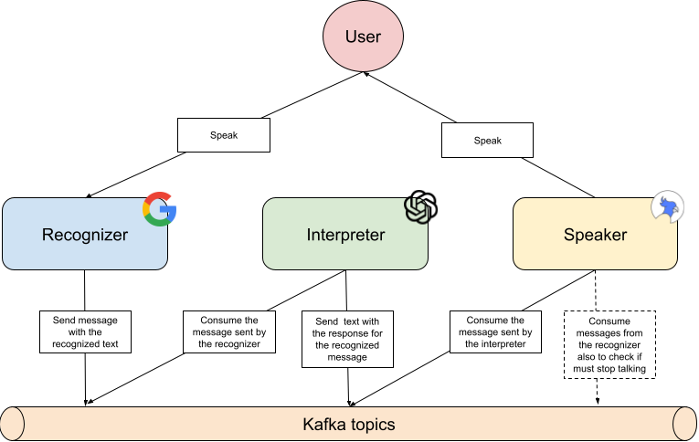

.. _intro-architecture:

============
Architecture
============

Ok, so now you want to know how katia really works.

As we said in the :ref:`main doc <topics-index>`, Katia is based on three services, one
recognizer that will recognize your voice and translate the audio to text. One
interpreter that will interpret that message and return a text as a response. And finally
one speaker that will reproduce that generated text.

But, how they communicate with each-other, when the speaker knows that it can talk? or
when the interpreter knows it can interpret? Well, they are sending messages to kafka
topics.

This way we are able to decouple completely the different modules, so if they grow in
complexity and functionalities we can separate them to a different services easily.

For example you can run the recognizer and the speaker on the client side, but manage the
interpreter in a dedicated server.

While they are connected to the same Kafka this will work.

There is one weak limitation. If you want Katia to work better you should run the
recognizer and the speaker in the same host. As some of the things it is doing is checking
if she is already talking (using mixer).

So if you separate them, it will work yes, but maybe she tries to interact with herself.

.. _intro-architecture-schema:

Schema
------

The main architecture is as follows:

|

As you can see, the different modules have no dependencies between them, so they can be
easily decoupled.
